# HMM 隐马尔可夫模型

## 概率图

变量X可观察，变量Z不可观察

HMM中存在两个概率分布：

- $\theta$ : 状态转移矩阵，表示不可观察变量Z的A，B两个状态的互相转移概率（2x2）
- $\mu_A,\mu_B$ ：表示两个状态到可观察变量X的T，H两个状态的发射概率矩阵（1x2，1x2）

## HMM主要处理两类问题

1. 模型参数$\theta,\mu_A,\mu_B$ 已知，X可观测时，求Z，就是个inference问题，使用viterbi算法。
2. 模型参数$\theta,\mu_A,\mu_B$ 未知，X已知 ，Z未知时，由于隐变量Z未知，需要使用EM-style进行参数估计

### 问题一

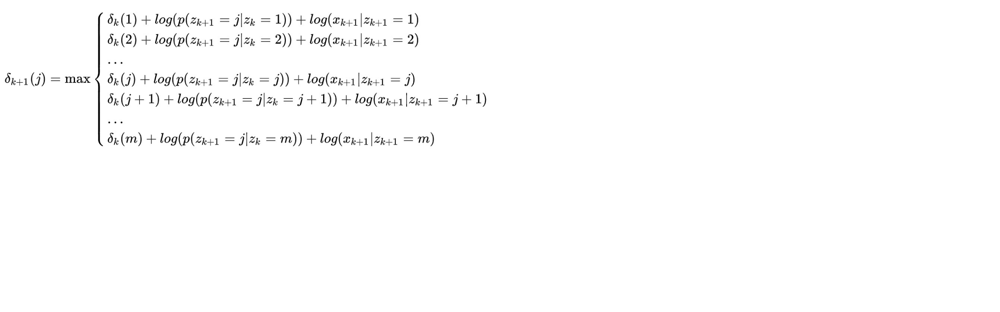

由以上公式可以得出Z的最佳状态分布，其时间复杂度为$O(m^2l)$ （注：m为Z可选的状态数，l为序列长度）

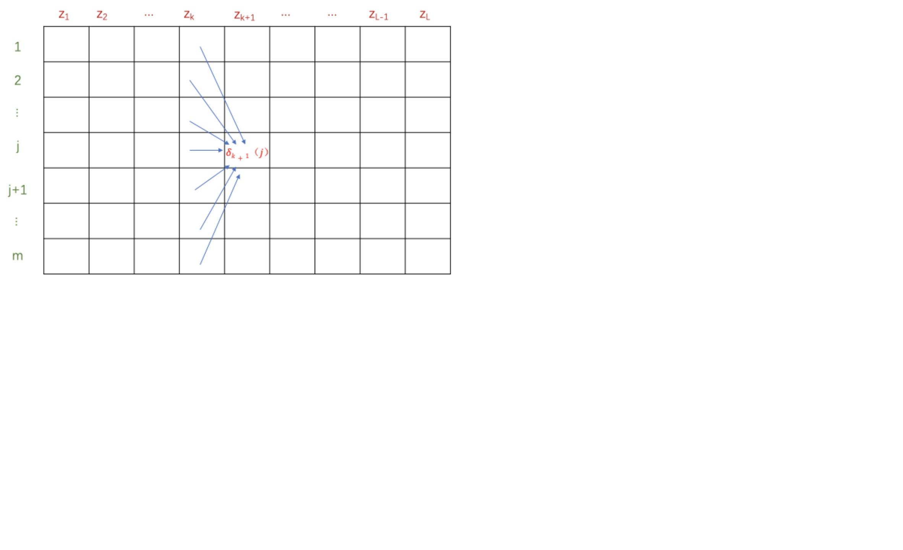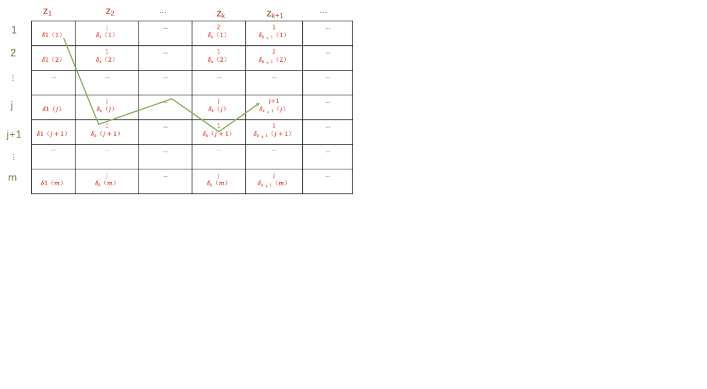

### 问题二

解决问题二有两个关键点

1. Forward-Backward算法
2. 参数估计

对于问题二，已知X，求Z，则有条件概率$P(z_k|x)$ 由于$P(x)$ 已知，可等价于求取联合概率$P(z_k,x)$ ，可对问题建模为求取联合概率$P(z_k,x)$，然后利用D分离定律进行进一步化简，得出前项和后项（文末补充D分离定律）：

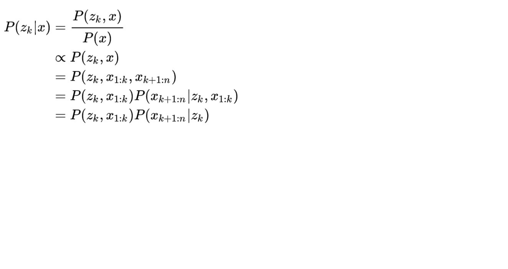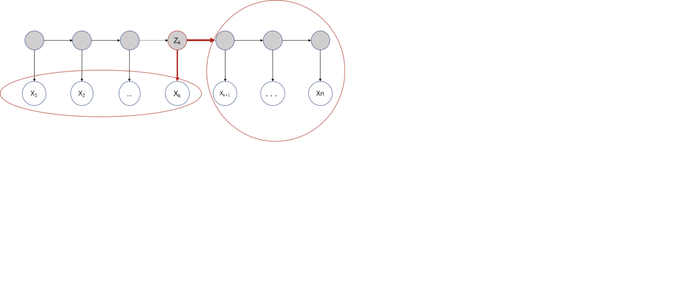

由上式可得最终求取的式子为——前项与后项的乘积，然后根据D分离定律可对前项和后项分别化简，过程如下：

前项推导：

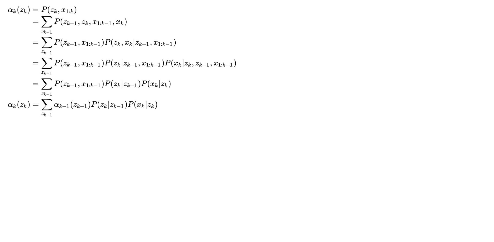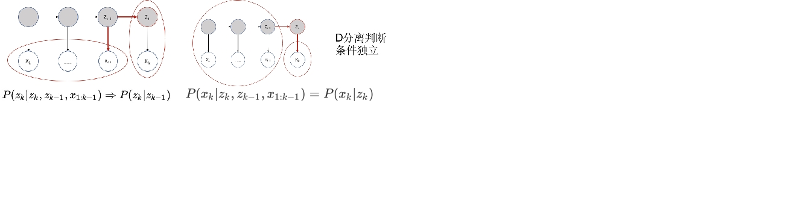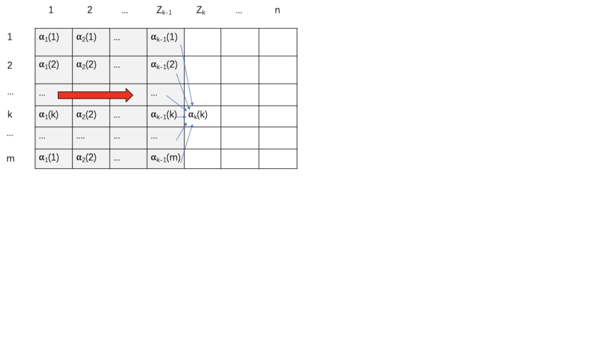

后项推导：

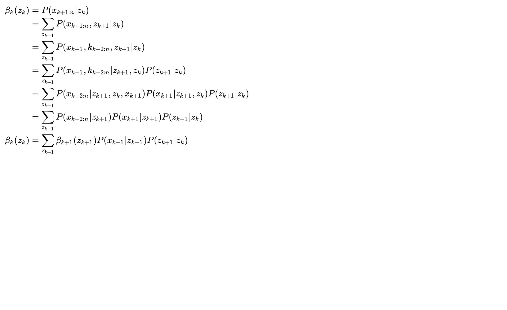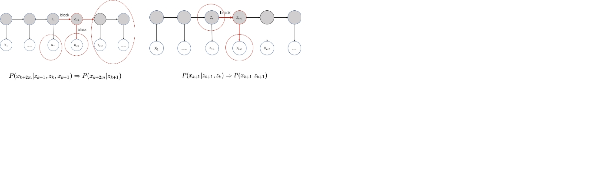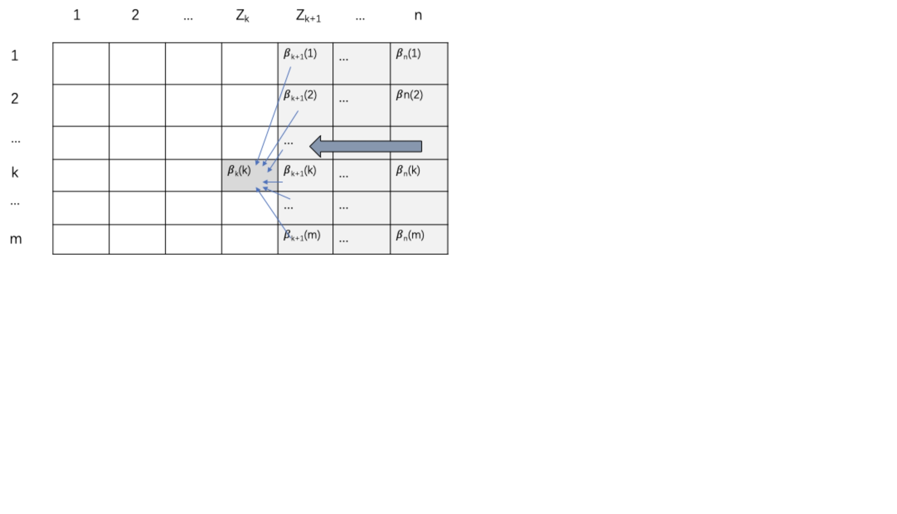

最终forward-backward的结果为：
$$
P(z_k,x) = \alpha_k(z_k)\beta_k(z_k)\\
其中：\\
\alpha_k(z_k)=\sum_{z_{k-1}}\alpha_{k-1}(z_{k-1})\ P(z_{k}|z_{k-1})P(x_k|z_k) \\
\beta_k(z_k)=\sum_{z_{k+1}}\beta_{k+1}(z_{k+1})\ P(x_{k+1}|z_{k+1})P(z_{k+1}|z_{k})
$$
然后使用EM算法求解参数：

- E：计算后验使用Forward-Backward :  $E_{z|x,\theta}$  

- M: 估计参数 :   $argmax_{\theta}\ln{P(x,z;\theta)}$ 

  注：对于转移矩阵$\theta$ ，统计所有给定样状态Z之间转移的频数归一化得到概率，即可得到$\theta$ 。 对于发射矩阵$\mu$ ，统计所有Z生成X的转移频数归一化即可，这样就得到了$\mu$ 。 使用数据中的Z状态是E计算之后随机生成出来的，然后根据随机数据得来的$\theta,\mu$ 重新计算后验概率，然后调整Z的状态分布，然后重复以上步骤直到收敛。

<u>--------------------------------------------------------------------------------------------------------------</u>

注：补充D分离定律（无路则独）：

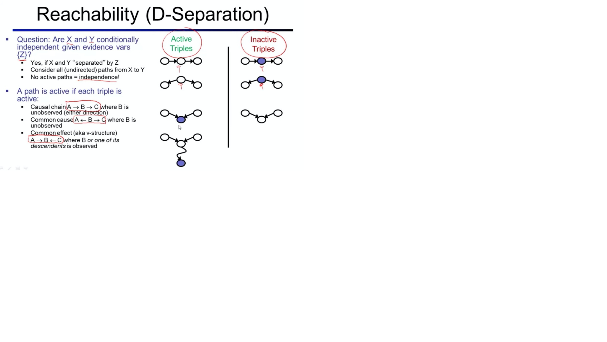

