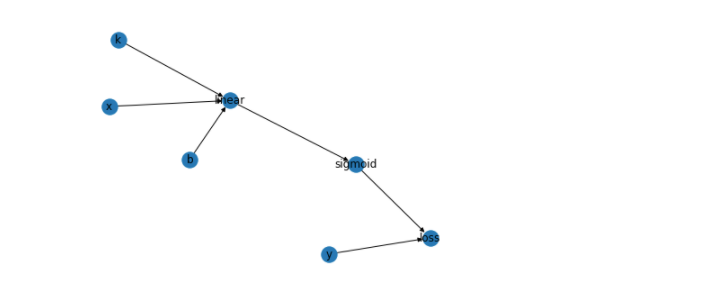

### 传播方向（顺序）
我们先定义如下的一个模型，我们根据这个模型来探寻如何定义传播方向
```python
def model(x,k,b):
    #line1
    out_1 = x * k + b
    #sigmoid1
    out = sigmoid(out_1)
    return out
```
我们代码里的这个模型很简单:

1. x,k,b 输出各自的值到一个linear中 获得 out_1
2. linear输出 out_1 到sigmoid获得 out

我们将以上的过程用一个dict来表示 并补充上 y 和 loss：
```python
computing_graph={
    'k':['linear'],
    'b':['linear'],
    'x':['linear'],
    'linear':['sigmoid'],
    'sigmoid':['loss'],
    'y':['loss']
}
```
我们将这个dict用画图工具画出来：

那么我们的传播方向就很直观的展现出来了，箭头的方向就是传播的正方向
（要实现这个顺序的求取需要使用拓扑排序）

### forward-propagation
我们按照这个传播方向从 k,x,b 开始一步步计算下一步的输出值计算到loss节点的时候就能获得loss的值 ；
我们称这样的按正向顺序计算出每个节点值的计算方式为forward-propagation（正向传播/前向传播）

根据我们的定义我们可以知道，在计算每一层的结果的时候需要使用forward-propagation

### back-propagation

back-propagation 也就是反向传播算法

前向传播我们已经理解了，那么我们怎么理解反向传播呢，什么时候会使用反向传播呢？

在神经网络的计算过程中想要使模型进行优化就需要对每一层的参数进行有方向的调整（增大参数值或者减小参数值），那么参数调整的方向是怎么获得的呢？
众所周知，这其实是通过求loss函数对各参数的偏导获取的

那么在层数较多的神经网络中如何计算loss对第一层参数的偏导呢，一般情况下神经网络的层数越多，拟合函数越复杂，计算偏导也就越复杂，
总不能每次出现复杂函数都需要人为的计算出偏导公式吧，如果函数复杂到短时间根本写不出求导公式怎么办，
根据数学知识可知我们可以使用复合函数链式求导的方式，
根据链式法则我们有以下公式：
```python
 ∂loss/∂k = ∂loss/∂sigmoid * ∂sigmoid/∂linear * ∂linear/∂k
 ∂loss/∂b = ∂loss/∂sigmoid * ∂sigmoid/∂linear * ∂linear/∂b
```
用公式可知想要计算∂loss/∂k 需要按顺序计算 
∂loss/∂sigmoid , ∂sigmoid/∂linear , ∂linear/∂k 然后将他们的结果相乘，

讨论到这，我们不难发现求取偏导的过程正好就是按照模型计算的反方向一步步计算的，
我们把这种按照与计算方向相反的反向求取偏导的过程成为back-propagation（反向传播），

反向传播算法是在计算loss对参数的偏导值的时候使用的一种计算方法，这种计算方法使得计算机可以灵活的计算不同复杂函数的偏导数，使复杂函数自动求导的想法得以实现


