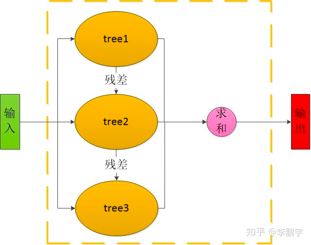
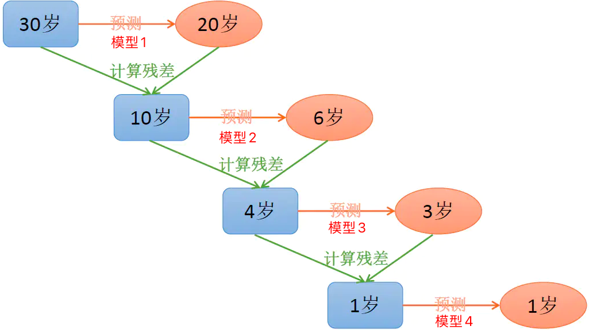
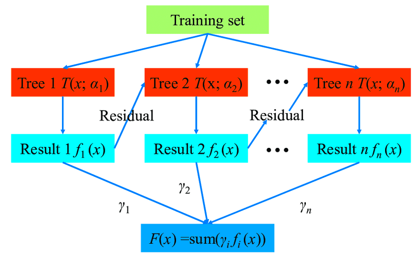

### 简介

分类与回归树(Classification and Regression Tree, CART)是一种经典的决策树，是一种以二叉树为逻辑结构的树，可以用来处理涉及连续数据的分类或者回归任务，它和它的变种在当前的工业领域应用非常广泛。

### 决策树思想

决策树上的叶子节点表示结论，非叶子节点表示特征。一个样本从根节点开始，根据不同特征做出决策（分裂），拆分成子节点，直到只包含一种类别(即一种结论)的叶子节点为止。

通过对决策树算法思想的了解我们可以判断出该算法中的关键是分裂的标准是什么？怎么分才是最好最恰当的分裂方式？

以分类为例，显然，如果一种分裂方式能把正负样本完全的划分开，我们就称该分裂方式为最佳分裂方式。为了量化“最佳”，即为了判断一种分裂方式是否将样本完全分裂为正负样本，我们引入一种评测方式：熵

### 信息熵和基尼不纯度

信息熵：信息熵是信息论中用于度量信息量的一个概念。一个系统越是有序，信息熵就越低；反之，一个系统越是混乱，信息熵就越高。所以，信息熵也可以说是系统有序化程度的一个度量。（直白的解释就是一堆样本都属于一类那这堆样本的熵就很低，如果这堆样本中包含很多类别那他的熵就比较高）

信息熵的计算公式：
$$
H(x) = -\sum_{i=1}^n P(X = i)\log{P(X=i)}
$$
其中$P(X=i)$ 为随机变量X取值为i的概率

基尼不纯度：基尼不纯度实际上是对信息熵的一种简化计算，其公式为：
$$
Gini(D)=1 - \sum_{x=1}^n{p_x^2}
$$

### 构建分类树

有了对"最佳"的量化方法，我们利用这些指标，来指导我们应该选择哪个特征、特征怎么分叉，保证每一步“分裂”都是最优的，一直迭代到叶子节点为止。显然这个决策树的构建算法就是个贪心算法。考虑到算法实现的问题，这个决策树最好是二叉的而不是多叉，所以我们一般用二叉的CART(Classification And Regression Tree)算法构建决策树。

### 构建回归树

决策树用于回归问题，思路与用分类问题的思路是一样的。只是将分裂好坏的评价方法，由信息熵改成平方误差函数

### 集成学习

在使用决策树的时候发现他比较容易过拟合，而且如果是全量样本都用来训练一颗树的话会使得这棵树过于复杂，同时缺少泛化能力，为了解决这种问题，我们通常需要对树的结构进行约束，利用剪枝等方法来砍掉冗余的分支，使得树结构尽量简单，以提高树模型在未训练数据上的预测表现(也就是泛化能力)。除此之外，集成学习(Ensemble Learning)，横向/纵向 地增加多个树，并利用多个树模型结果综合判断，也是个能提高模型性能常用方法。

集成学习大概可以分为两大类：基于bagging思想 和 基于boosting思想

##### 集成方式为bagging的算法主要有：RandomForrest(随机森林)


随机森林构建流程如下:

```
1. 把原始集上随机只采样N份样本数据集，且每份样本数据集随机只采样M个特征，得到若干份数据集
2. 在每个数据集上独立构建一颗决策树，得到N颗决策树
```

随机森林使用流程如下:

```
1. 把待预测的样本数据，输入到N个决策数，得到N个预测结果   
2. 对这些预测结果，以投票(分类)或平均(回归)的计算方式最终结果
```

可见，在随机森林里面，每一颗决策树的构建(训练)都独立的，他们之间是并行的没有依赖。只是在最后使用(预测)时，要把森林上所有树的结果都过一遍，通过大家投票或平均的方式给出一个final decision。

##### 集成方式为bagging的算法主要有: Boosting Decision Tree, GBDT, Xgboost







以上图解即为GBDT的训练结构图和GBDT的架构图，实际上Boosting Decision Tree, GBDT, Xgboost 三种算法的结构都是类似的，区别在于Boosting Decision Tree 计算残差的时候是通过计算t时刻树结构的预测值与t时刻真实值之间的差来求取的；而GBDT则是使用损失函数的负梯度近似代替残差；Xgboost则是GBDT思想的进一步优化，主要引入了二阶导数使得算法误差更小

