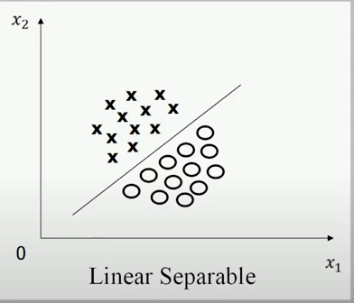
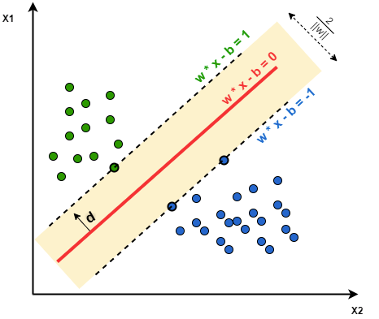

### SVM简介
SVM英文全称是support vector machines，中文叫做支持向量机。

虽然如今工业界SVM的使用频率不高，但是它十余个非常经典的算法，具有完善的数学理论

### 线性可分
首先了解一下什么是线性可分

如图，在二维欧式空间上，两类点被一条直线完全分开叫做线性可分。

下边给出数学上的定义：

D0 和 D1 是 n 维欧氏空间中的两个点集。如果存在 n 维向量 w 和实数 b，使得所有属于 D0 的点 xi 都有 wxi + b > 0，而对于所有属于 D1 的点 xj 则有 wxj + b < 0 ，则我们称 D0
和 D1 线性可分。

### 最大间隔超平面

超平面是指n维线性空间中维度为n-1的子空间。它可以把线性空间分割成不相交的两部分。例如：一维空间中超平面是一个点；
二维空间中超平面是一条线；三维空间中超平面就是一个平面；以此类推

将对线性可分的讨论从二维空间扩展到多维空间中时，将D0 和 D1 完全正确划分开的 wx + b = 0 就成了一个多维空间中的超平面。

显然能划分两个点集的超平面有很多个，现在需要找出最佳的超平面来划分两个点集。

一般称能以最大间隔把两类点集分开的超平面为最佳超平面，也称之为 最大间隔超平面。最大间隔超平面一定满足一下两点：

* 不同类型的样本分别分布在该超平面的两侧
* 两侧距离该超平面最近的样本点到该超平面的距离是所有满足条件的超平面中距离最大的

### 支持向量

样本中距离超平面最近的一些样本点叫做支持向量。

下图中位于两条虚线上的一个绿点和两个蓝点都是支持向量，红色的实线是是一个分离超平面

### SVM最优化问题

了解以上的概念后，该怎么求得最佳的超平面呢，也就是如何求出最大间隔超平面？

任意超平面有以下表达式:
$$
w^Tx + b = 0
$$
二维空间中点到直线的距离公式为：
$$
\frac{|Ax+By+c|}{\sqrt{A^2+B^2}}
$$
扩展到n维空间中之后 点 x = {x~1~ ,x~2~ , ...... ,x~n~ }到直线 $w^Tx + b = 0$ 的距离为：
$$
\frac{|w^Tx + b|}{||w||}
$$
其中 $||w|| = \sqrt{w_1^2+w_2^2.....+w_n^2}$ .

我们定义支持向量到超平面的距离为d，则点集内其他点到超平面的距离大于d，两个不同点集的类别为y，则存在以下公式
$$
\left\{ \begin{matrix}
\frac{w^Tx + b}{||w||}>=d &	,y=1\\
\frac{w^Tx + b}{||w||} <=-d &	,y=-1
\end{matrix}
\right.\\

\Downarrow\\
\frac{y(w^Tx+b)}{||w||}>=d>=0
$$
为求得最大间隔超平面 则:
$$
d=\frac{y(w^Tx+b)}{||w||}
$$
为使两类点集之间有清晰的边界同时方便我们推导我们限定：$y(w^Tx+b)=1$ ，则求最大距离的问题转化为 求：
$$
max(\frac{2}{||w||})
$$
即：
$$
min(\frac{1}{2}||w||)
$$
为了计算方便我们可以去除不必要的开放运算，则优化为：
$$
min(\frac{1}{2}||w||^2)
$$
综上所述我们的最终优化为题转化为：
$$
\min{\frac{1}{2}||w||^2}\quad s.t. \quad y_i(w^Tx_i+b)>=1
$$
